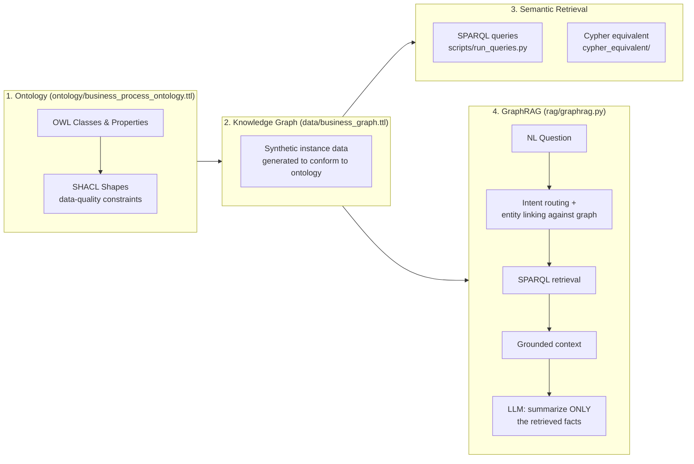

# Enterprise Knowledge Graph + GraphRAG

A small, fully-runnable project exploring how to ground LLM-based agents in
**verified, structured enterprise knowledge** rather than surface-level text
retrieval — using an ontology, a knowledge graph, and a GraphRAG pipeline
built on top of it.

I built this to get hands-on with ontology design, knowledge graphs, and
semantic grounding for AI agents, since most of my prior work has been on
the modeling/LLM side rather than the knowledge-representation side. Business
process data (orders, invoices, payments, fulfillment) is a good sandbox for
this because every mid-to-large company runs some version of this process
regardless of which ERP or CRM system sits underneath it — so the same
ontology pattern applies whether the source system is SAP, Oracle NetSuite,
Salesforce, or an in-house system.

## Why this domain

The order-to-cash cycle (Customer → Order → Line Items → Invoice → Payment →
Delivery) has exactly the properties that make an ontology worth building
rather than skipping straight to a flat table:

- Multiple entity types with **directional, typed relationships**
  (an Invoice is *generated by* an Order, not the reverse)
- Business rules that are naturally **constraints**, not just documentation
  (an invoice amount can't be negative; every order traces back to exactly
  one customer)
- Multi-hop questions that are awkward in SQL but natural as a graph
  traversal ("which *paid* invoices for *enterprise* customers involve
  *software* products delivered in the last 60 days?")

## Architecture



## Repo layout

```
ontology/business_process_ontology.ttl   OWL classes, object/datatype properties, SHACL shapes
scripts/generate_graph.py                Generates synthetic instance data conforming to the ontology
scripts/run_queries.py                   Business-question SPARQL queries against the graph
data/business_graph.ttl                  Generated knowledge graph (RDF/Turtle, ~880 triples)
cypher_equivalent/                       Neo4j/Cypher schema + equivalent queries (property-graph version)
rag/graphrag.py                          GraphRAG: NL question -> SPARQL retrieval -> grounded LLM answer
```

## Running it

```bash
pip install -r requirements.txt

python scripts/generate_graph.py     # build the knowledge graph
python scripts/run_queries.py        # run the SPARQL business questions
python rag/graphrag.py               # run the GraphRAG demo
```

Set `ANTHROPIC_API_KEY` to have `rag/graphrag.py` actually call an LLM to
summarize the retrieved facts; without a key it prints the grounded context
that *would* be sent, so the retrieval logic is verifiable on its own.

## Design decisions worth discussing

**RDF/OWL + SPARQL, not straight to a property graph.**
I used RDF/Turtle and SPARQL as the primary implementation because it's
self-contained (`rdflib`, no server needed) and because RDF's global-URI
identity model is what actually enables federating data *across* systems —
which is the real problem an enterprise semantic layer needs to solve when
data comes from multiple source systems that each have their own notion of
"Customer." I also included a Cypher/Neo4j-equivalent schema in
`cypher_equivalent/` to make the trade-off concrete: property graphs are
usually faster for pure multi-hop traversal and more natural for engineers,
but you give up the standardized reasoning/inference and cross-vendor
interoperability RDF/OWL gives for free.

**SHACL shapes as a first-class artifact, not an afterthought.**
Enterprise data is never clean. `ontology/business_process_ontology.ttl`
includes SHACL constraints (e.g. invoice amounts must be non-negative), and
`pyshacl.validate()` confirms the generated graph conforms — this is the
same pattern a real ingestion pipeline would use to reject bad records
*before* they corrupt the semantic layer.

**Template-based SPARQL retrieval in GraphRAG, not free-form text-to-SPARQL.**
`rag/graphrag.py` deliberately uses a small intent classifier + parameterized
query templates rather than asking an LLM to generate arbitrary SPARQL. For
high-stakes numeric/financial questions ("how much overdue revenue"), an
LLM-generated query that's subtly wrong is worse than a template that's
narrower but auditable. This is a real trade-off (coverage vs. reliability)
and the honest answer in production is usually a hybrid: templates for
known high-stakes question shapes, LLM-generated SPARQL with validation/
guardrails for the long tail.

**Entity linking against the graph, not free-text NER.**
The first version of `extract_customer_name()` used a naive capitalized-word
regex and it broke immediately — it matched the leading word of the question
("What") as confidently as an actual company name. The fix links against
customer names *already in the graph* rather than trying to recognize
entities from raw text in isolation, which is both more reliable and a
better illustration of why grounding in structured knowledge beats
pattern-matching on surface text — the whole thesis of this project.

## Possible extensions

The same pattern extends to other business processes (procurement,
fulfillment, financial close) by adding sibling ontology modules that share
common upper-level classes (e.g. a shared `LegalEntity` superclass for
customers and vendors) — this is how a real enterprise semantic layer is
composed from multiple domain ontologies rather than one monolithic schema.
Other directions worth exploring: swapping the template-based retrieval for
an LLM-generated SPARQL layer with validation guardrails, or adding a
second, related domain (e.g. procurement) to test how well shared upper-
ontology classes hold up across processes.
